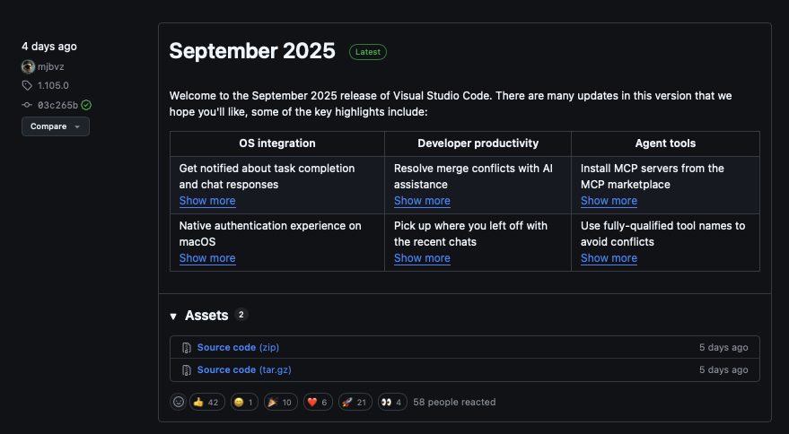
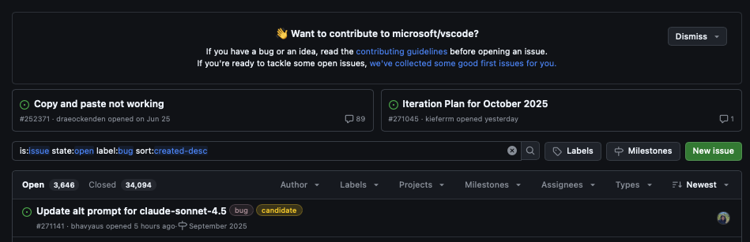
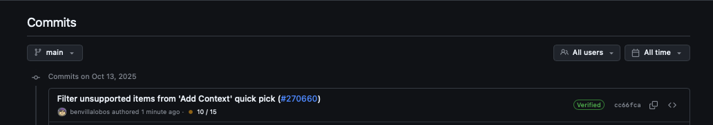
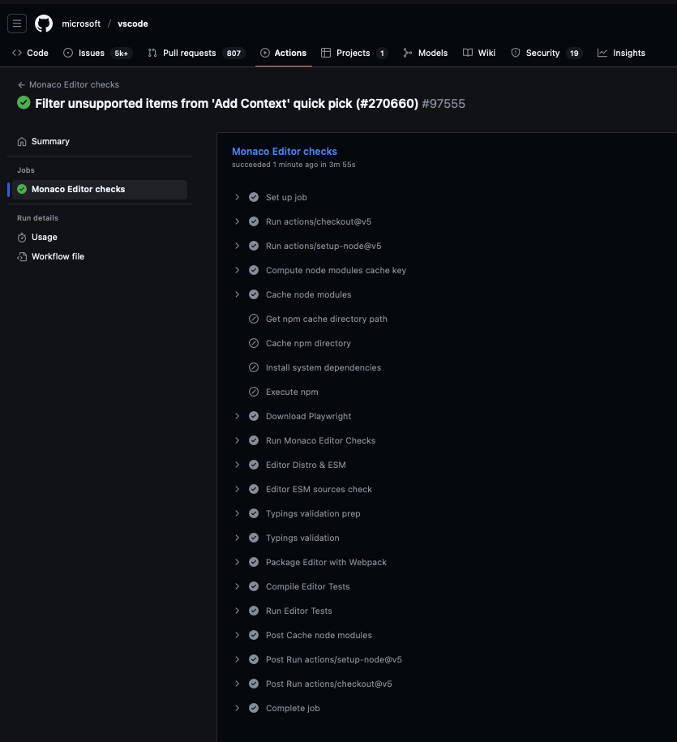

## Taller 1: La Anatomía de un Repositorio (Exploración Guiada)

```bash
Repositorio a analizar [microsoft/vscode](https://github.com/microsoft/vscode).
```

```bash
1.  Encontrar la Versión: Localiza la sección "Releases" y anota el número de la última versión.
```

<p align="center">
  
</p>


```bash
2.  Investigar un Bug: Ve a la pestaña "Issues", usa el filtro `Label` y encuentra un `bug` abierto.
```

<p align="center">
  
</p>


```bash
3.  Revisar Cambios Recientes: Ve a la pestaña "Code" y haz clic en el historial de "commits". ¿Quién hizo el último cambio en la rama principal?
```

<p align="center">
  
</p>


```bash
4.  Ver la Automatización: Explora la pestaña "Actions". Encuentra un workflow de CI y observa sus pasos.
```

<p align="center">
  
</p>