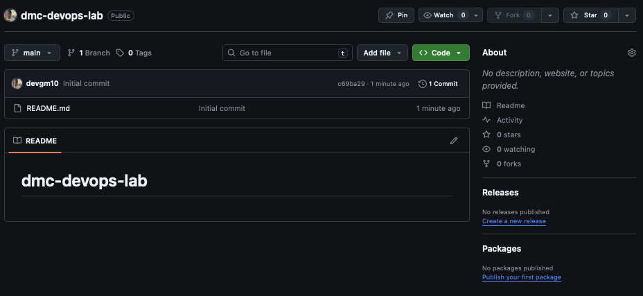

## Taller 1: Flujo de Trabajo Fundamental: Branches y Merges

### 📌 Objetivo: 

Aprender a trabajar de forma segura y organizada en un proyecto y utilizando ramas de
funcionalidad para cada nueva tarea. Este es un flujo recomendado para proyectos personales.
(No participan personas adicionales)


### Paso 01: Crear y Clonar tu Repositorio

```bash
    1.  Crea el repositorio en github con el nombre: dmc-devops-lab con las siguientes características:
        El Owner debe ser el nombre del Usuario
        El repositorio debe ser tener visibilidad público: Visibility: Se debe habilitar la creación de 
        README (Add README: on) public
```

<p align="center">
  
</p>
