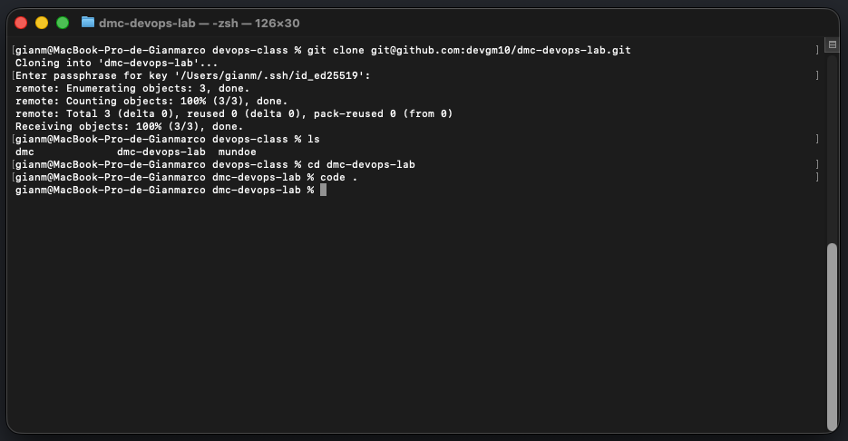
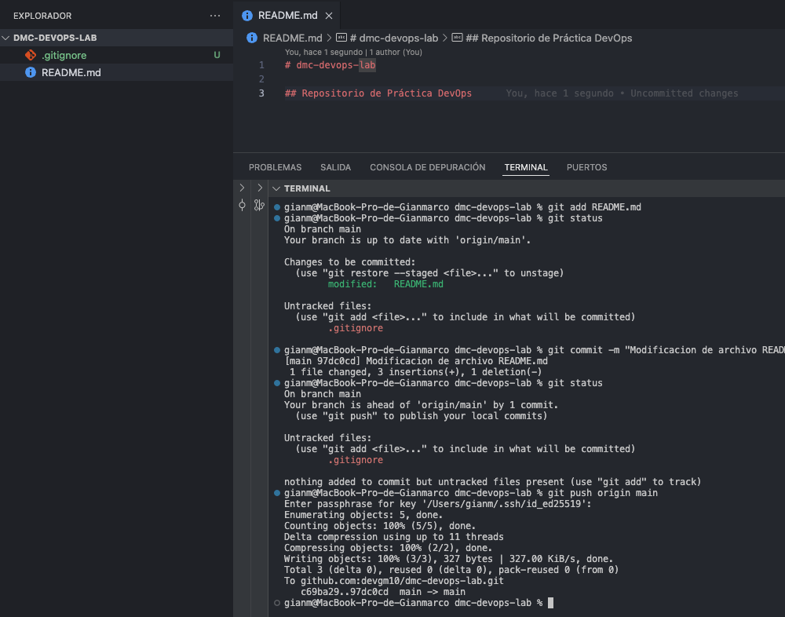
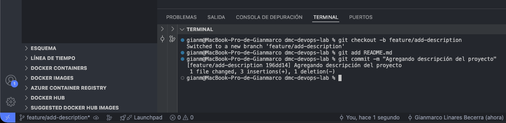

## Taller 1: Flujo de Trabajo Fundamental: Branches y Merges

### 📌 Objetivo: 

Aprender a trabajar de forma segura y organizada en un proyecto y utilizando ramas de
funcionalidad para cada nueva tarea. Este es un flujo recomendado para proyectos personales.
(No participan personas adicionales)


### Paso 01: Crear y Clonar tu Repositorio

```bash
    1.  Crea el repositorio en github con el nombre: dmc-devops-lab con las siguientes características:
        El Owner debe ser el nombre del Usuario
        El repositorio debe ser tener visibilidad público: Visibility: Se debe habilitar la creación de 
        README (Add README: on) public
```

<p align="center">
  
</p>


### Paso 02: Realizar un nuevo Commit

```bash
    1.  Agregamos la siguiente linea dentro del archivo README.md

        ## Repositorio de Práctica DevOps

    2.  Prepara el archivo para ser versionado (lo añades al "Staging Area"):

        $ git add README.md

    3.  Verificar estado de git del repositorio

        $ git status

    4.  Confirma los cambios en tu historial local. 
        (Se agrega el comando -m que hace referencia al mensaje que se escribirá a continuación)

        $ git commit -m "Modificacion de archivo README.md"

    5.  Verificar estado de git del repositorio

        $ git status

    6. Sube tus cambios a GitHub:

        $ git push origin main
```

<p align="center">
  
</p>

<p align="center">
  
</p>


### Paso 03: Usar una Rama de Funcionalidad (Feature Branch)

```bash
    1.  Crea una nueva rama para tu trabajo y cámbiate a ella:

        $ git checkout -b feature/add-description

    2.  Añade contenido al README.md:

        "Este repositorio contiene ejercicios para el curso de DevOps."

    3.  Haz commit de tus cambios en esta rama:

        $ git add README.md
        $ git commit -m "Agregando descripción de proyecto"

```

<p align="center">
  
</p>
