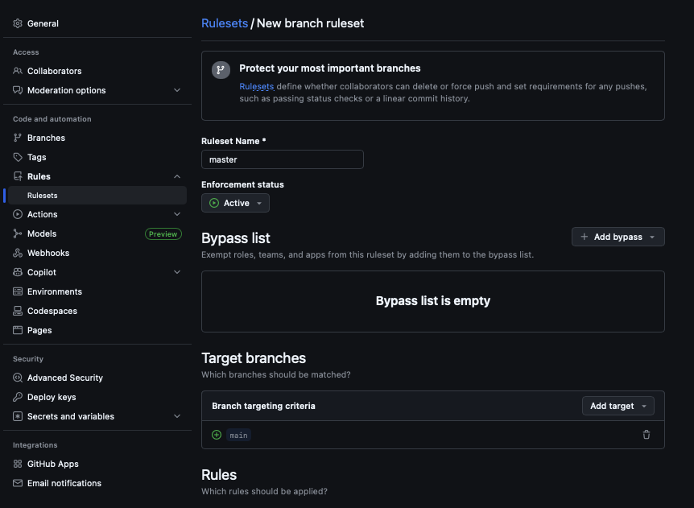
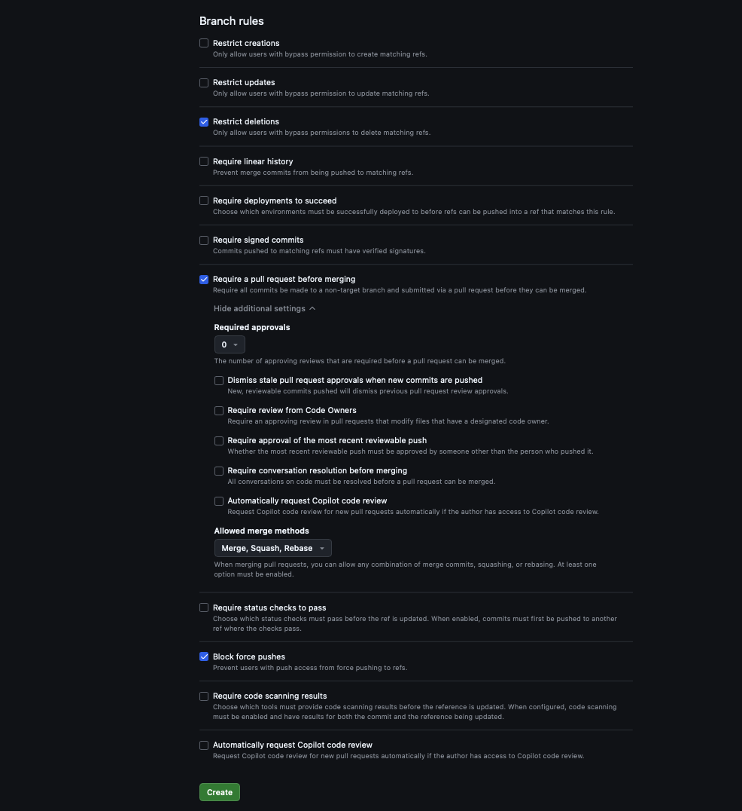
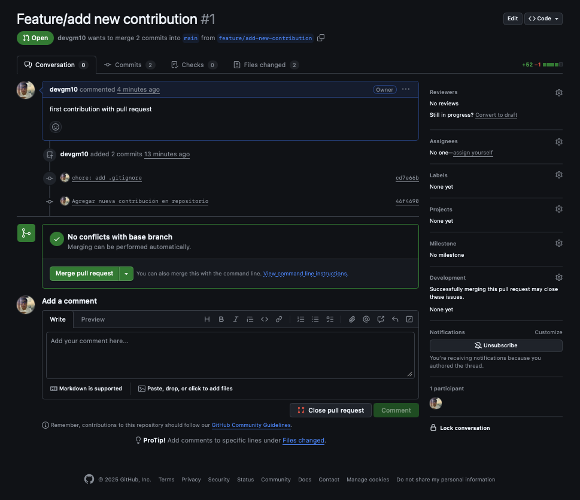

## Taller 2: Flujo de Colaboración: Forks y Pull Requests

### 📌 Objetivo: 

Aprender el estándar de la industria para contribuir a proyectos en los que no tienes permiso de
escritura directo gestionandolos con Pull Requests (PRs).

### Paso 01: Configura Ruleset en Github Actions

```bash
    1.  Ve a la página de del Repositorio en GitHub

    2.  Ve a Settings > Rules > Rulesets

    3.  Click en New ruleset > New branch ruleset

    4.  Completar con los siguientes datos
        °   Ruleset Name: master
        °   Enforcement status: Active
        °   En la sessión Target Branches > Add Target > Include by pattern > coloca main > Add Inclusion patter
        °   Marca la casilla: Require a pull request before merging (Esta es la configuración necesaria para que
            cualquier cambio a la branch main deba ser realizado a través de un pullrequest)
        °   Navega hasta la parte inferior del formulario y haz click en Create para crear la Ruleset.
```

<p align="center">
  
</p>

<p align="center">
  
</p>


### Paso 02: Crea una nueva branch a partir de branch main

```bash
    1.  Crea una nueva rama para tu contribución:

        $ git status
        $ git checkout -b feature/add-new-contribution

    2.  Edita el README.md para añadir tu:

        "Contribución realizada a través de un pull request"

    3.  Haz commit de tus cambios y súbelos a tu repositorio:

        $ git add README.md
        $ git commit -m "Agregar nueva contribución en repositorio"
        $ git push origin feature/add-new-contribution
```


### Paso 03: Crear el Pull Request

```bash
    1.  Ve a la página de del Repositorio en GitHub. Verás un banner sugiriendo crear un Pull Request.
        Haz clic en "Compare & Pull Request"

    2.  Revisa que la rama base sea main y la rama de comparación sea feature/add-new-contribution.

    3.  Escribe un título claro y una descripción para tu PR. Haz clic en "Create pull request".
```

### Paso 04: Fusión

```bash
    1.  Revisa que no hayan conflictos y valida los apartados del Pull Request:
        °   "Conversation": Se pueden agregar comentarios y etiquetar a usuarios
        °   "Commits": Revisar lista de commits que se agregaron en el Pull Request
        °   "Checks": Revisión de Pipelines ejecutados, en este punto no tenemos pipelines configurados.
        °   "Files changed": Modificaciones realizadas
```

<p align="center">
  
</p>