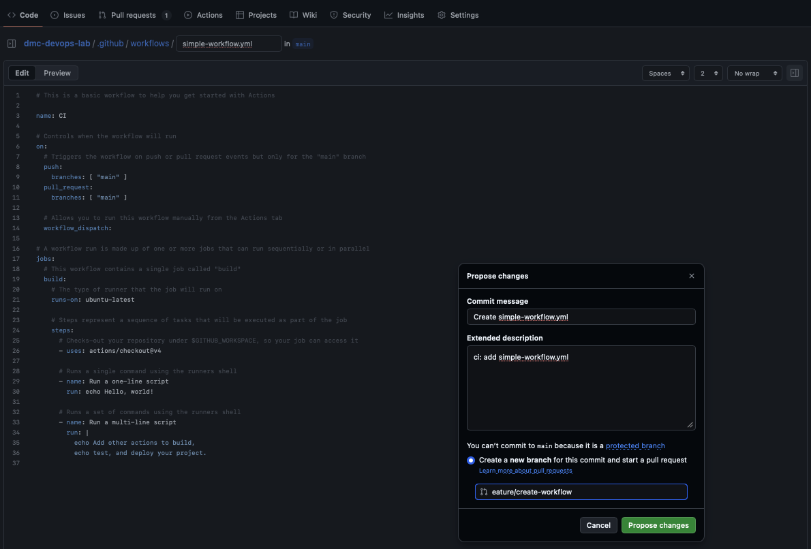
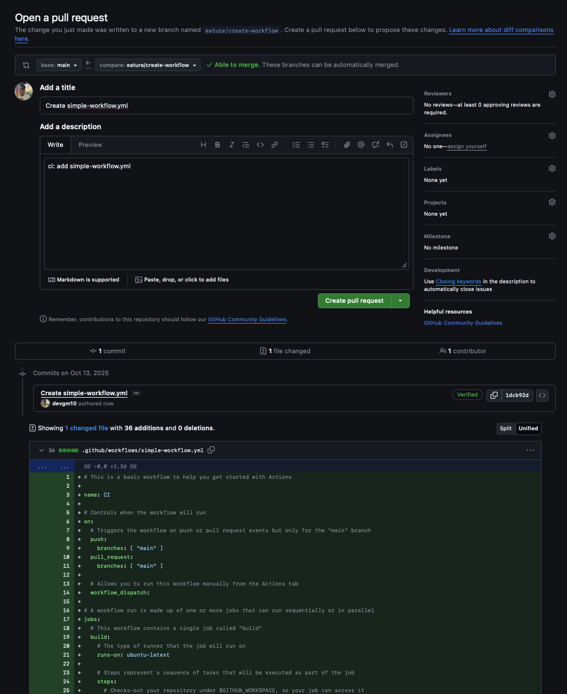
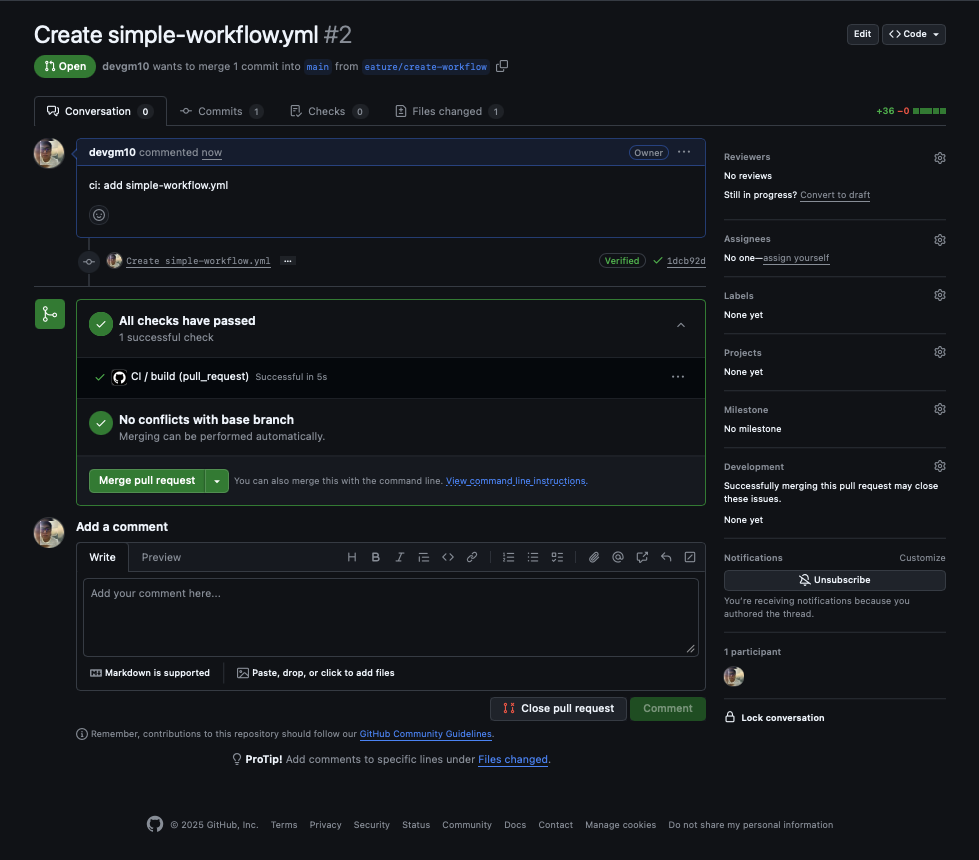
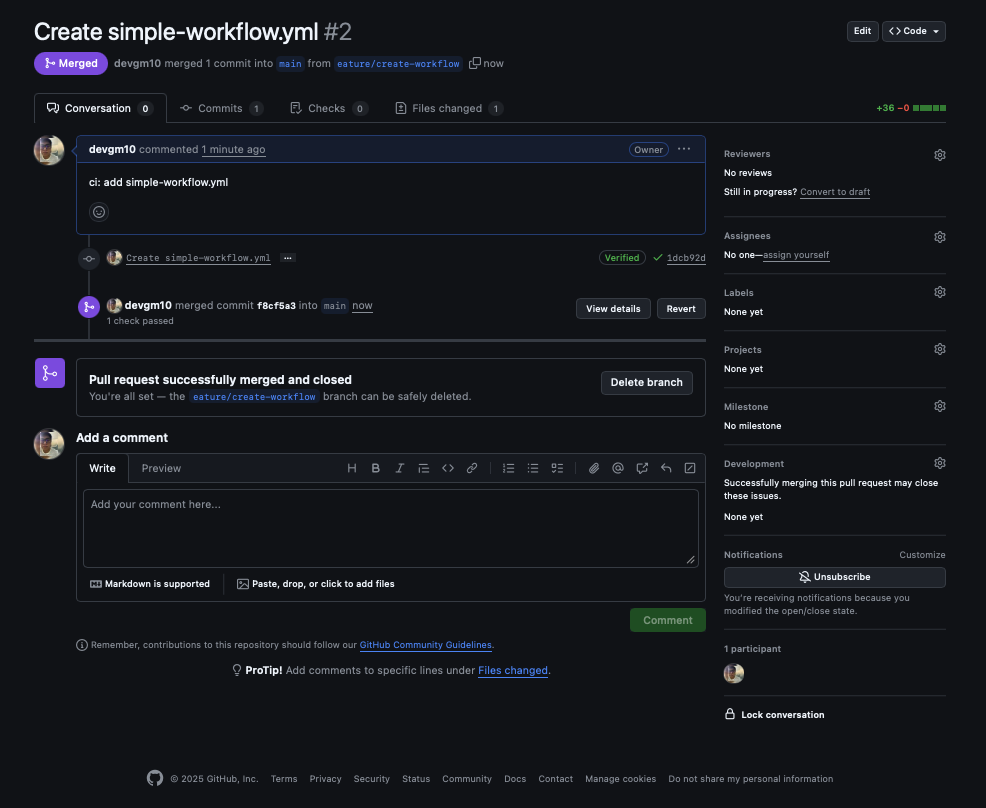

## Taller 3: Automatización Básica con GitHub Actions (CI)

### 📌 Objetivo: 

Crear una pipeline de Integración Continua (CI) que se ejecute automáticamente cuando se crea
un Pull Request y se aprueba el Pull Request.

### Paso 01: Crear workflow predefinido de GitHub

```bash
    1.  Ve a la página de del Repositorio en GitHub. Haz clic en "Actions",
        busca "Simple workflow" en la lista, y dale click en "Configure".

    2.  Se abrirá una nueva pantalla, cambiar nombre de archivo yaml a: "simple-workflow.yml",
        dar click en "Commit changes..." (botón verde).

    3.  Agregar un mensaje de commit, y marcar la opción de: "Create a new branch for 
        this commit and start a pull request", cambiar nombre de branch a: "feature/create-workflow",
        click en "Propose changes".

    4.  Se creará un Pull Request con los cambios. Haz click en "Create Pull Request".
    
    5.  Verificar "Checks" del Pull Request, un wokflow de github actions de ha ejecutado con las
        definiciones del archivo yaml.

    6.  Haz click en "Merge Pull Request" y crear un mensaje o aceptar el mensaje predeterminado. Revisar
    logs de ejecución.
```

<p align="center">
  
</p>

<p align="center">
  
</p>

<p align="center">
  
</p>

<p align="center">
  
</p>


