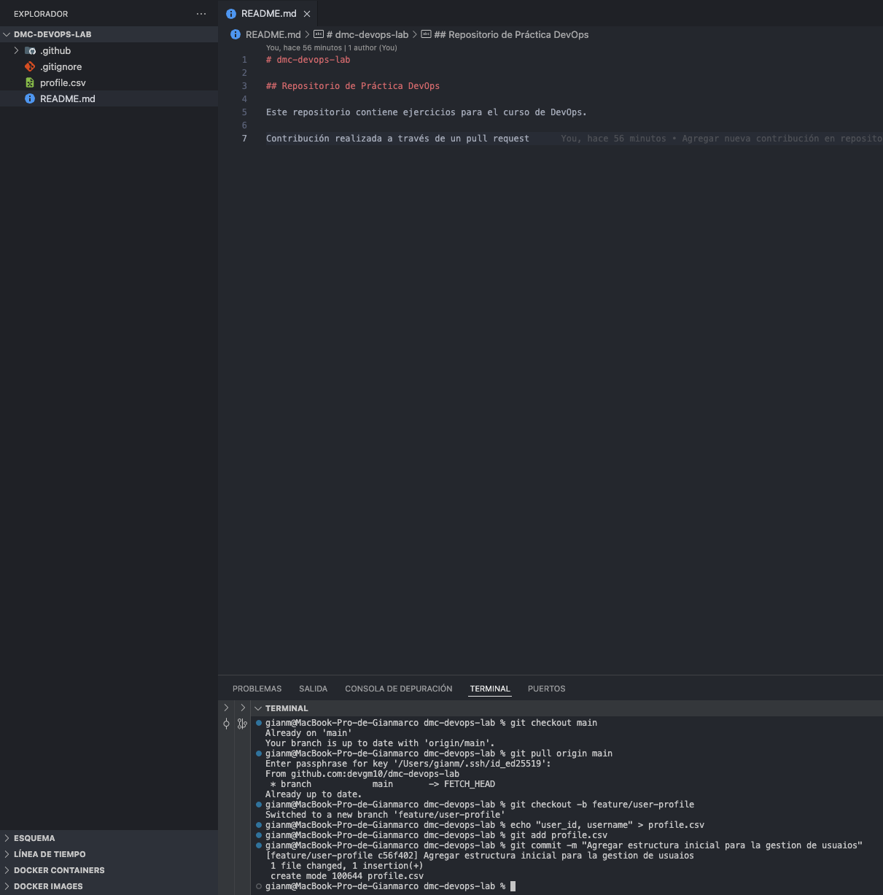

## Taller 4: Estrategia de Branching con GitHub Flow

### 📌 Objetivo: 

Gestionar un escenario realista combinando el desarrollo de una nueva funcionalidad con la
resolución de un hotfix urgente, usando la estrategia de GitHub Flow.

### 📄 Escenario: 

Estás trabajando en una nueva funcionalidad (feature/user-profile) cuando surge un bug
crítico en producción que debes solucionar de inmediato.


### Paso 01: Iniciar el Trabajo en la Nueva Funcionalidad

```bash
    1.  Asegúrate de estar en main y tener la última versión:}
        $ git checkout main
        $ git pull origin main

    2.  Crea la rama para tu nueva funcionalidad:
        $ git checkout -b feature/user-profile

    3.  Haz un commit inicial para simular trabajo:
        $ echo "user_id,username" > profile.csv
        $ git add profile.csv
        $ git commit -m "Agregar estructura inicial para gestion de usuario"
```

<p align="center">
  
</p>