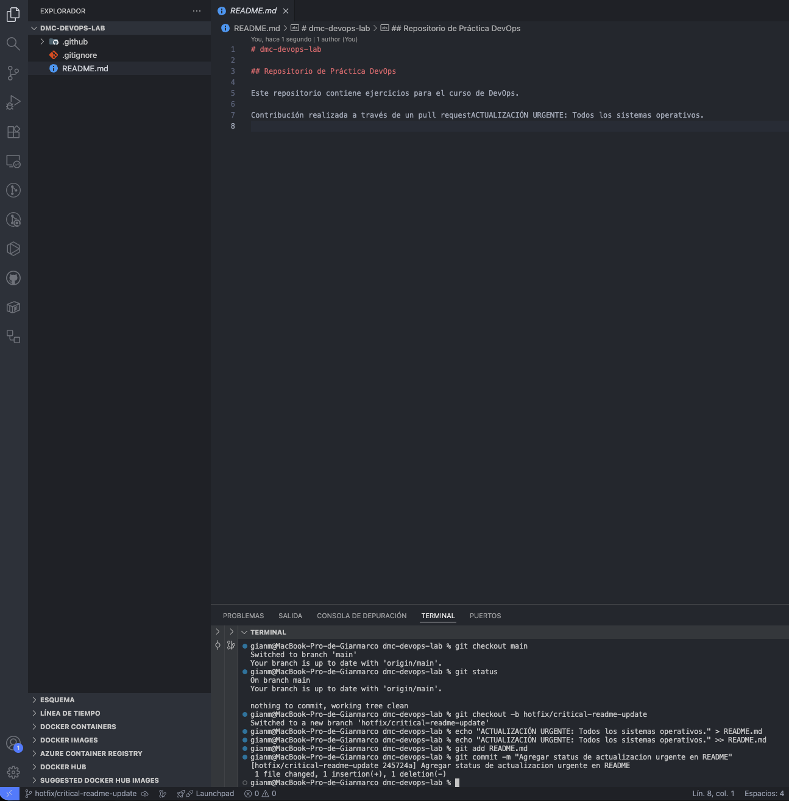
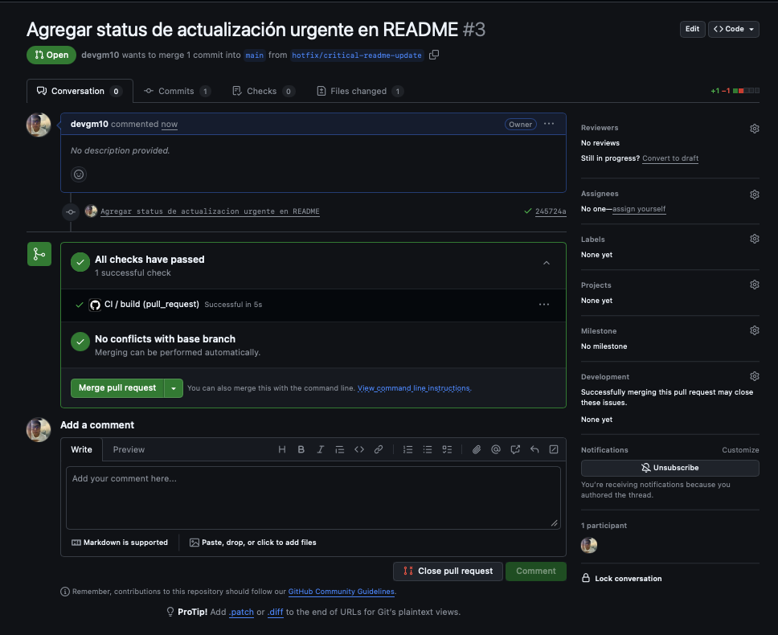
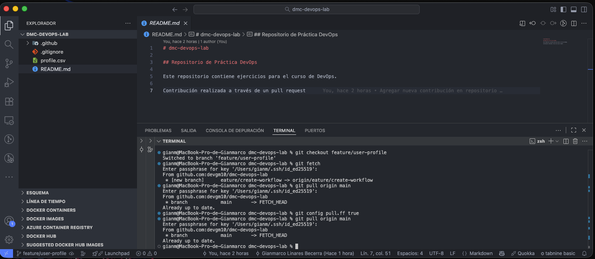

## Taller 4: Estrategia de Branching con GitHub Flow

### 📌 Objetivo: 

Gestionar un escenario realista combinando el desarrollo de una nueva funcionalidad con la
resolución de un hotfix urgente, usando la estrategia de GitHub Flow.

### 📄 Escenario: 

Estás trabajando en una nueva funcionalidad (feature/user-profile) cuando surge un bug
crítico en producción que debes solucionar de inmediato.


### Paso 01: Iniciar el Trabajo en la Nueva Funcionalidad

```bash
    1.  Asegúrate de estar en main y tener la última versión:
        $ git checkout main
        $ git pull origin main

    2.  Crea la rama para tu nueva funcionalidad:
        $ git checkout -b feature/user-profile

    3.  Haz un commit inicial para simular trabajo:
        $ echo "user_id,username" > profile.csv
        $ git add profile.csv
        $ git commit -m "Agregar estructura inicial para gestion de usuario"
```

<p align="center">
  
</p>


### Paso 02: Gestionar el Hotfix Urgente

```bash
    1.  Pausa el trabajo actual: Deja tu rama de feature tal como está y vuelve a la rama principal:
        $ git checkout main

    2.  Crea una rama específica para el hotfix:
        $ git checkout -b hotfix/critical-readme-update

    3.  Aplica la corrección urgente (en este caso, añade una línea al README):
        $ echo "ACTUALIZACION URGENTE: Todos los sistemas operativos." >> README.md
        $ git add README.md
        $ git commit -m "Agregar status de actualizacion urgente en README"
```

<p align="center">
  
</p>


### Paso 03: Desplegar el Hotfix

```bash
    1.  Sube la rama del hotfix a GitHub:
        $ git push -u origin hotfix/critical-readme-update

    2.  Ahora ve a GitHub y crea una Pull Request.
```

<p align="center">
  
</p>


### Paso 04: Sincronizar tu Rama de Funcionalidad

```bash
    1.  Vuelve a tu trabajo original:
        $ git checkout feature/user-profile

    2.  Tu rama ahora está "detrás" de main. Debes traer los cambios del hotfix
        a tu rama para evitar futuros conflictos.
        $ git fetch
        $ git pull origin main

    3.  ¡Listo! Tu rama feature/user-profile ahora contiene tanto tu trabajo inicial
        como la actualización crítica de main. Puedes continuar desarrollando de forma segura.

    4.  Te aparecerá un error, ya que es necesario configurar la estrategia para 
        hacer la mezcla de datos:
        $ git config pull.ff true

    5.  Ahora reintenta la mezcla:
        $ git pull origin main
```

<p align="center">
  
</p>