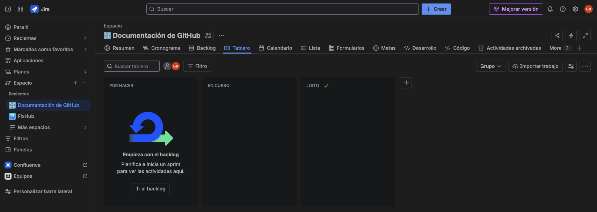

## Taller 1: Creación y Exploración del Espacio

### 📌 Objetivo: 

Crear un nuevo Espacio en Jira desde cero, seleccionando la plantilla correcta, y familiarizarte con
las secciones clave.


### Paso 01: Creación del Espacio

```bash
    1.  Inicia sesión en tu cuenta de Jira.
    
    2.  Haz clic en el boton "+" del menu de la izquierda que aparece junto a "Espacios"
    
    3.  Jira te preguntará qué plantilla usar. En la sección "Software development", selecciona la plantilla "Scrum".

        - ¿Por qué Scrum?
            Esta plantilla está preconfigurada con las herramientas que usan los equipos ágiles:
            Sprints, Backlog, Estimaciones y Reportes de Velocidad. Es ideal para un desarrollo
            iterativo e incremental.

    4.  Haz clic en "Usar plantilla".

    5.  Luego, te pedirá que selecciones un tipo de Espacio: "Gestionado por el equipo" o "Gestionado por la compañía".
        Elige "Gestionado por el equipo" (Team-managed).

        -   ¿Por qué "Gestionado por el equipo"? Es más simple y flexible. Permite que el propio equipo
            configure sus flujos de trabajo y tableros sin necesidad de un administrador global de Jira, lo
            cual es perfecto para nuestro taller.
    
    6.  Asigna un Nombre al Espacio: Documentación de GitHub. Jira generará automáticamente una Clave (ej. DG).
        Esta clave será el prefijo de todas tus incidencias (ej. DG-1).

    7.  Haz clic en "Crear Espacio"
    8.  ¡Listo! Ya tienes tu espacio de trabajo.
```

<p align="center">
  
</p>


### Paso 02: Exploración de la Interfaz

```bash
    1.  Lo primero que verás es el Tablero (Board). Por defecto, la plantilla Scrum crea tres columnas: 

        -   "Por hacer" (To Do),

        -   "En curso" (In Progress) y 

        -   "Hecho" (Done).

    2.  Explora el Menú Superior:
        -   Tablero (Board): Es la vista que ya conoces.

        -   Backlog: Aquí vivirá la lista completa de todas las tareas y requerimientos del Espacio.
            Es nuestra "lista de deseos" priorizada.

        -   Código (Code): Esta sección se activará cuando conectemos GitHub.

        -   Reportes (Reports): Un panel con métricas visuales para entender el rendimiento del equipo.
```