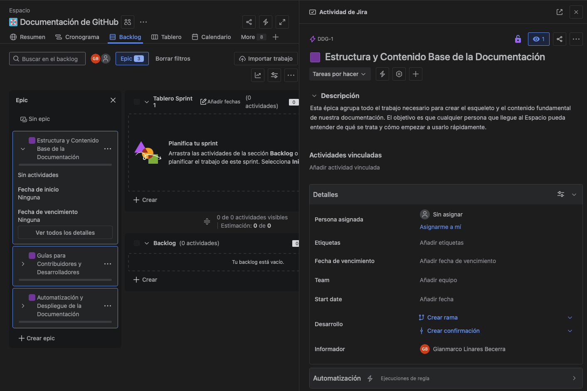
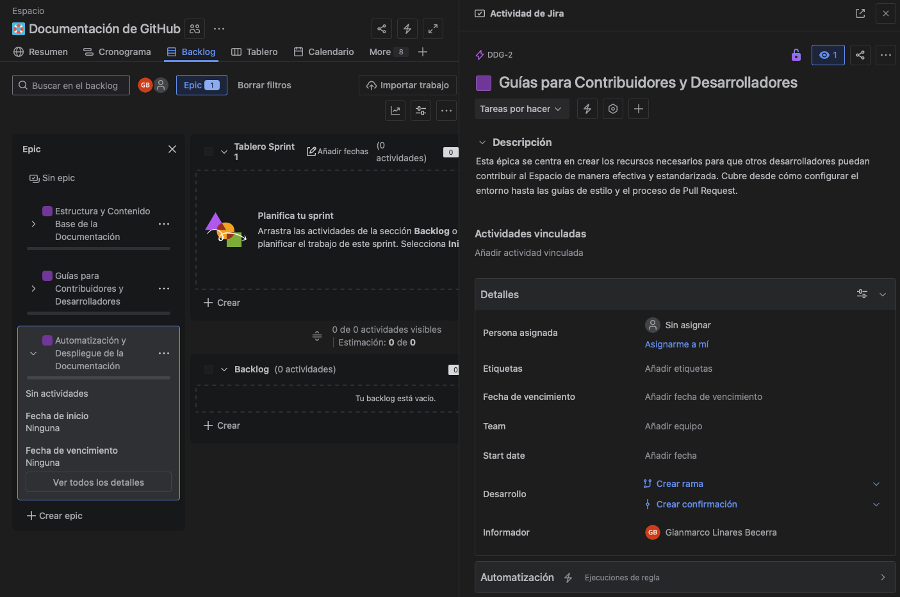
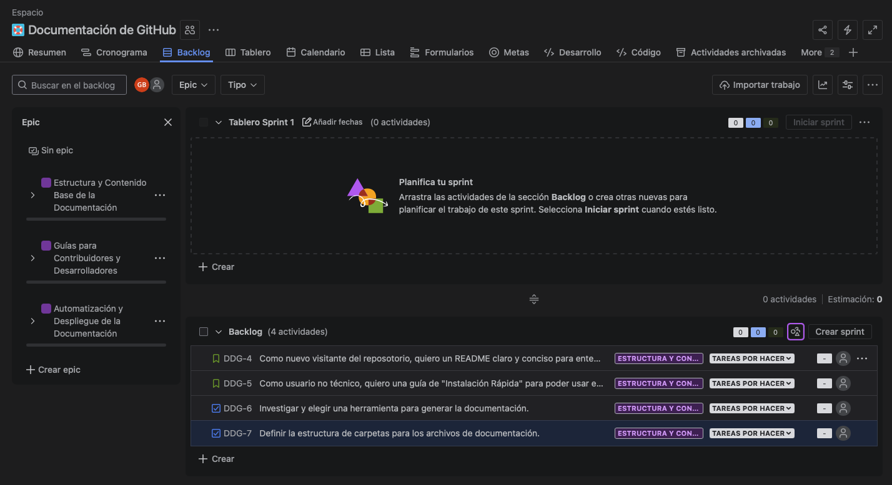
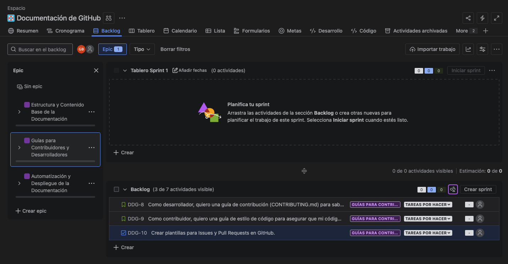
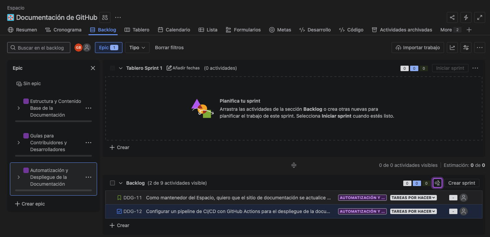
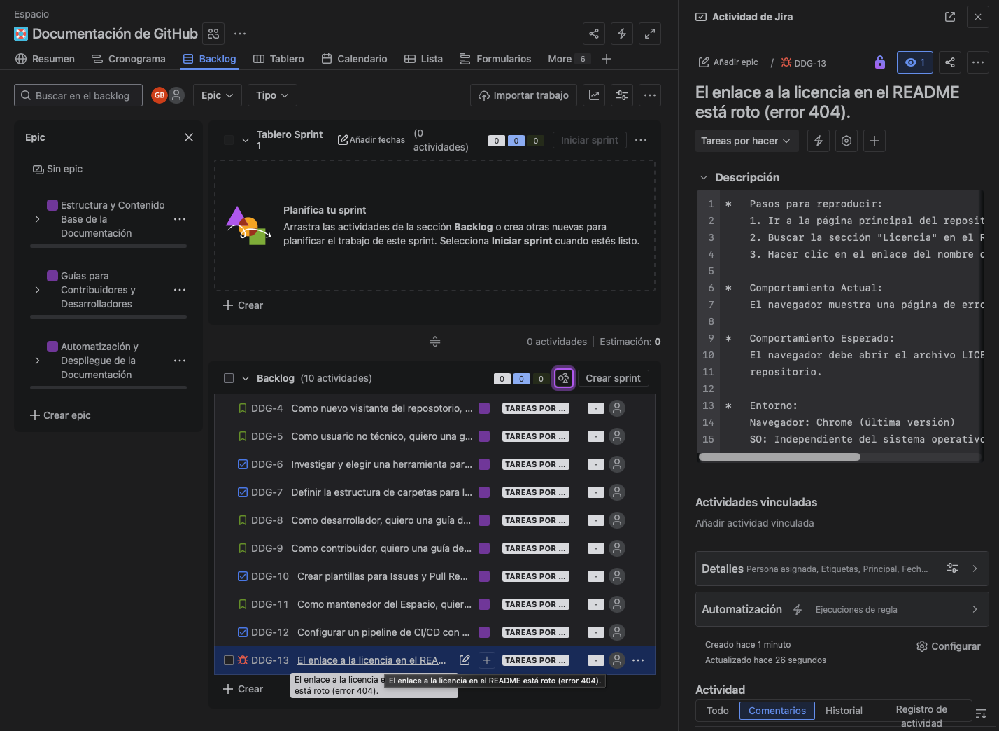

## Taller 2: Creación de Issues (Epic, Story, Task, Bug)

### 📌 Objetivo: 

Aprender a crear los diferentes tipos de "issues" (incidencias) en Jira y entender su jerarquía.
Crearemos la estructura fundamental de nuestro Espacio.

### 📄 Conceptos Clave: 

```bash
    -   Epic (Épica): Una gran iniciativa o cuerpo de trabajo que se descompone en historias.
    -   Story (Historia de Usuario): Un requerimiento que aporta valor al usuario.
    -   Task (Tarea): Una actividad técnica específica necesaria para el Espacio. Es una acción concreta.
    -   Bug (Error): Un defecto que impide que el software funcione como se espera.
```

### Paso 01: Crear las Épicas

```bash
    1.  Ve al Backlog y activa el panel de Épicas. (O pulsa el botón "e" para abrirlo)
    2.  Crea las 3 épicas:
        -   Épica 1:
            (*) Nombre: Estructura y Contenido Base de la Documentación
            
            (*) Descripción: Esta épica agrupa todo el trabajo necesario para crear el esqueleto y el
                contenido fundamental de nuestra documentación. El objetivo es que cualquier persona
                que llegue al Espacio pueda entender de qué se trata y cómo empezar a usarlo
                rápidamente.

        -   Épica 2:
            (*) Nombre: Guías para Contribuidores y Desarrolladores
            (*) Descripción: Esta épica se centra en crear los recursos necesarios para que otros
                desarrolladores puedan contribuir al Espacio de manera efectiva y estandarizada. Cubre
                desde cómo configurar el entorno hasta las guías de estilo y el proceso de Pull Request.

        -   Épica 3:
            (*) Nombre: Automatización y Despliegue de la Documentación
            (*) Descripción: El objetivo de esta épica es establecer un sistema automatizado que
                construya y publique el sitio de la documentación cada vez que se realizan cambios,
                asegurando que siempre esté actualizada sin intervención manual.
```

<p align="center">
  
</p>

<p align="center">
  
</p>

<p align="center">
  
</p>


### Paso 02: Poblar la Épica 1 "Estructura y Contenido Base"

```bash
    Crea las siguientes incidencias y asígnalas a la Épica 1:

    1.  Story:
        -   Título:
            Como nuevo visitante del repo, quiero un README claro y
            conciso para entender el propósito del Espacio en 1 minuto.
        
        -   Descripción / Criterios de Aceptación:
            "Dado" que abro la página principal del repositorio en GitHub.
            "Cuando" leo el archivo README.md.
            "Entonces" debo encontrar claramente:
                *   El nombre del Espacio.
                *   Una descripción de 1-2 frases sobre qué problema resuelve.
                *   Un enlace a la guía de "Instalación Rápida".
                *   Un badge que muestre el estado del build (CI).

    2.  Story:
        -   Título:
            Como usuario no técnico, quiero una guía de "Instalación
            Rápida" para poder usar el Proyecto sin ser un experto.
        
        -   Descripción / Criterios de Aceptación:
            "Dado" que estoy en el sitio de la documentación.
            "Cuando" navego a la sección "Instalación Rápida".
            "Entonces" la guía debe contener:
                *   Los prerrequisitos de software (ej. Node.js v18+).
                *   Comandos exactos que pueda copiar y pegar para instalar y ejecutar el espacio.
                *   Una captura de pantalla que muestre el resultado esperado tras la ejecución

    3.  Task:
        -   Título: Investigar y elegir una herramienta para generar la documentación.

        -   Descripción: Realizar un análisis comparativo entre MkDocs, Docusaurus y VitePress.
            La comparación debe evaluar: facilidad de uso, personalización, ecosistema de plugins y
            rendimiento. El entregable será un documento breve en Confluence o un comentario en
            esta misma tarea con la decisión final y su justificación.

    4.  Task:
        -   Título: Definir la estructura de carpetas para los archivos de documentación.

        -   Descripción: Proponer una estructura de directorios lógica para almacenar los archivos
            fuente de la documentación (ej. Markdown). La estructura debe ser escalable y separar
            claramente guías de usuario, tutoriales y referencias de API. El entregable es un
            esquema de la estructura de carpetas en formato de texto.
```

<p align="center">
  
</p>


### Paso 03: Poblar la Épica 2 "Guías para Contribuidores"

```bash
    Crea y asigna a la Épica 2:

    1.  Story:
        -   Título:
            Como desarrollador, quiero una guía de contribución (CONTRIBUTING.md)
            para saber cómo proponer cambios al código.
        
        -   Descripción / Criterios de Aceptación:
            "Dado" que soy un desarrollador que quiere contribuir.
            "Cuando" abro el archivo CONTRIBUTING.md.
            "Entonces" el documento debe explicar:
                *   Cómo hacer un fork y clonar el repositorio.
                *   Cómo instalar las dependencias de desarrollo.
                *   Cómo ejecutar los tests.
                *   El proceso para enviar un Pull Request.

    2.  Story:
        -   Título:
            Como contribuidor, quiero una guía de estilo de código para asegurar que
            mi código sea consistente con el del Espacio.
        
        -   Descripción / Criterios de Aceptación:
            "Dado" que estoy preparando un Pull Request.
            "Cuando" consulto la guía de estilo.
            "Entonces" debo encontrar:
                *   Un enlace a la configuración del linter (ej. ESLint, Prettier).
                *   Las convenciones de nombrado para variables, funciones y clases.
                *   Instrucciones sobre cómo formatear mi código automáticamente antes de
                    hacer commit.

    3.  Task:
        -   Título: Crear plantillas para Issues y Pull Requests en GitHub.

        -   Descripción: Crear los archivos de plantilla de Markdown dentro de la carpeta
            .github/ISSUE_TEMPLATE y .github/PULL_REQUEST_TEMPLATE.md. Se deben crear 
            plantillas para "Reporte de Bug" y "Propuesta de Nueva Funcionalidad".
```

<p align="center">
  
</p>


### Paso 04: Poblar la Épica 3 "Automatización y Despliegue"

```bash
    Crea y asigna a la Épica 3:

    1.  Story:
        -   Título:
            Como mantenedor del Espacio, quiero que el sitio de documentación 
            se actualice automáticamente cada vez que se fusiona un cambio en
            la rama principal.
        
        -   Descripción / Criterios de Aceptación:
            "Dado" que un Pull Request ha sido aprobado y fusionado en la rama main.
            "Cuando" el pipeline de CI/CD finaliza.
            "Entonces" el sitio web público de la documentación (ej. en GitHub Pages)
            debe reflejar los nuevos cambios en menos de 5 minutos.

    2.  Task:
        -   Título: Configurar un pipeline de CI/CD con GitHub Actions para el despliegue
            de la documentación.

        -   Descripción: Crear un archivo de workflow de GitHub Actions (.github/workflows/docs.yml)
            que se active en cada push a la rama main. El pipeline debe realizar los siguientes pasos:}
            
                1. Checkout del código, 
                2. Instalar dependencias,
                3. Construir el sitio estático de la documentación.
                4. Desplegar los artefactos construidos a la rama gh-pages.
```

<p align="center">
  
</p>


### Paso 05: Crear un Bug

```bash
    Crea una nueva incidencia:

    1.  Bug:
        -   Título:
            El enlace a la licencia en el README está roto (error 404).
        
        -   Descripción:
            *   Pasos para reproducir:
                1. Ir a la página principal del repositorio en GitHub.
                2. Buscar la sección "Licencia" en el README.md.
                3. Hacer clic en el enlace del nombre de la licencia (ej. "MIT License").
            
            *   Comportamiento Actual:
                El navegador muestra una página de error 404 de GitHub.
            
            *   Comportamiento Esperado:
                El navegador debe abrir el archivo LICENSE que se encuentra en la raíz del
                repositorio.

            *   Entorno:
                Navegador: Chrome (última versión)
                SO: Independiente del sistema operativo


<p align="center">
  
</p>
