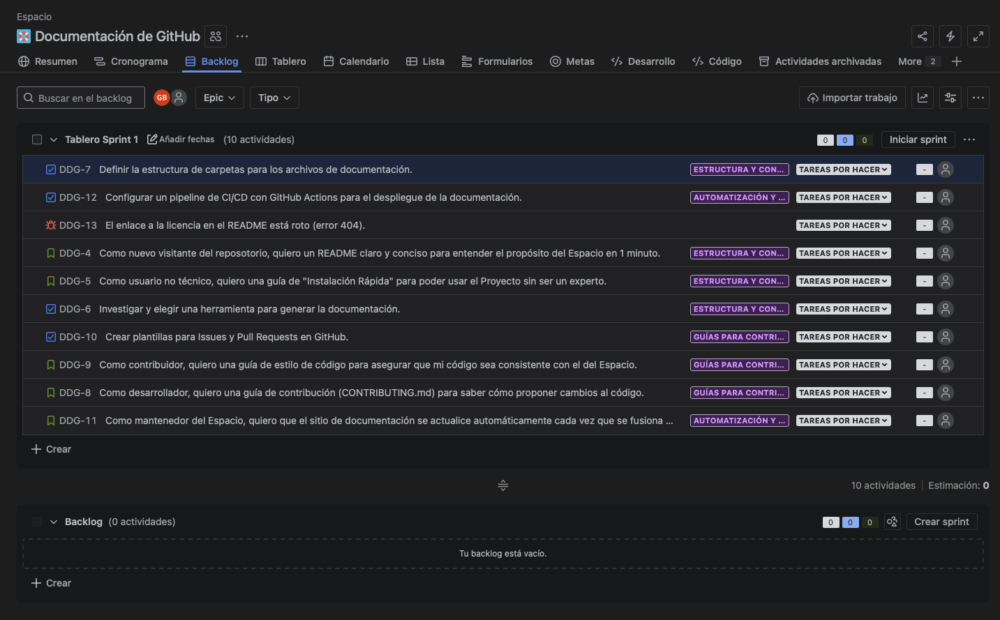

## Taller 3: Uso de Backlog y Sprint Planning

### 📌 Objetivo: 

Aprender a priorizar, personalizar el flujo de trabajo y planificar un Sprint.

### Paso 01: Priorizar el Backlog

```bash
    1.  Ve a la vista de Backlog.
    2.  Arrastra y suelta las incidencias para ordenarlas. Un buen orden inicial podría ser:
        -   (Bug) El enlace a la licencia...
        -   (Story) Como nuevo visitante... quiero un README claro...
        -   (Task) Investigar y elegir una herramienta...
        -   (Story) Como usuario no técnico... quiero una guía de "Instalación Rápida"...
        -   ...y el resto.
```

<p align="center">
  
</p>