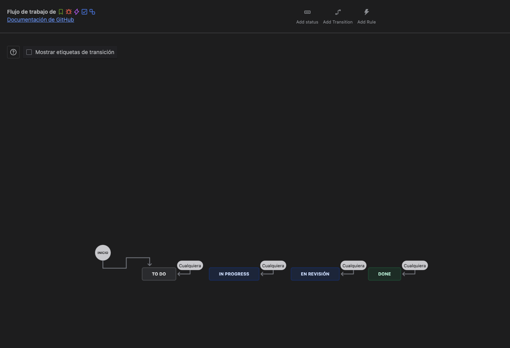
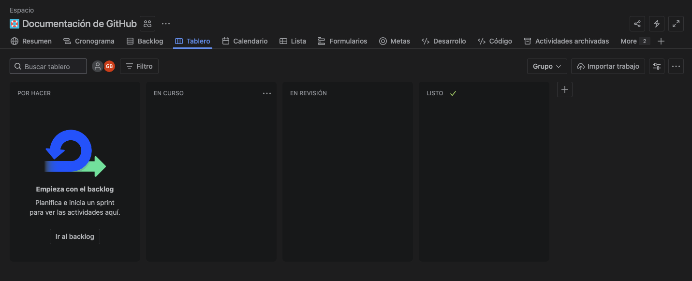
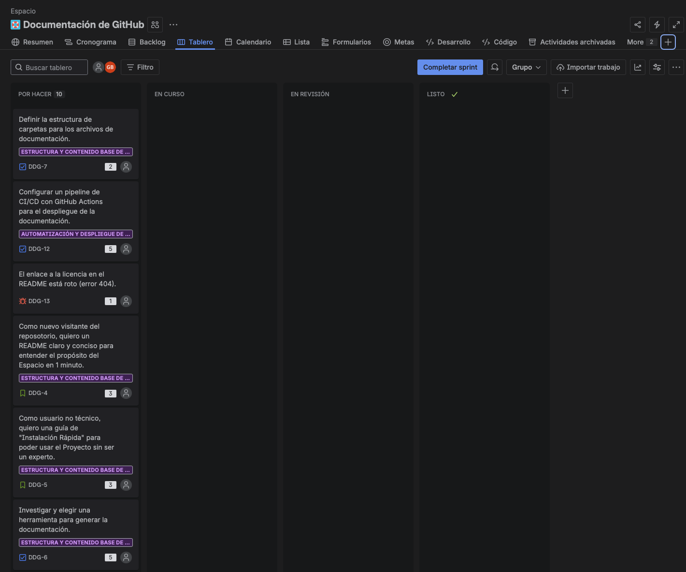

## Taller 3: Uso de Backlog y Sprint Planning

### 📌 Objetivo: 

Aprender a priorizar, personalizar el flujo de trabajo y planificar un Sprint.

### Paso 01: Priorizar el Backlog

```bash
    1.  Ve a la vista de Backlog.
    2.  Arrastra y suelta las incidencias para ordenarlas. Un buen orden inicial podría ser:
        -   (Bug) El enlace a la licencia...
        -   (Story) Como nuevo visitante... quiero un README claro...
        -   (Task) Investigar y elegir una herramienta...
        -   (Story) Como usuario no técnico... quiero una guía de "Instalación Rápida"...
        -   ...y el resto.
```

<p align="center">
  
</p>


### Paso 02: Personalizar el Tablero

```bash
    1.  Ve al Tablero (Board).

    2.  En la esquina superior derecha, haz clic en los tres puntos (...) y 
        selecciona "Gestionar Flujo de Trabajo"

    3.  Aquí verás los estados existentes ("Por hacer", "En curso", "Hecho")
        que se corresponden con las columnas del tablero.

    4.  Haz clic en el botón "+ Añadir estado"

    5.  Escribe el nombre del nuevo estado: "En Revisión" (In Review).

    6.  Asegúrate de que la Categoría del estado esté establecida en "En curso" (In Progress).
        -   Explicación:
            Esto es crucial para los reportes. Al marcarlo como "En curso", le indicas a Jira
            que el trabajo en esta fase todavía se considera activo y no está terminado, lo cual
            afecta a métricas como el Cycle Time.

    7.  Haz clic en "Actualizar Flujo de Trabajo"

    8.  Jira creará automáticamente una nueva columna para este estado, normalmente al final.

    9.  Ahora, arrastra la columna "En Revisión" para que quede posicionada entre "En curso" y "Hecho".

    10. El flujo de trabajo visual en el tablero ahora será: Por hacer -> En curso -> En Revisión -> Hecho.

    11. Vuelve al tablero principal (haciendo clic en "Tablero" en el menú lateral) para ver tu nueva columna
        en acción.
```

<p align="center">
  
</p>

<p align="center">
  
</p>


### Paso 03: Crear y Planificar el Sprint 1

```bash
    1.  Regresa al Backlog.

    2.  Arrastra las siguientes incidencias al Sprint 1:
        -   (Bug) El enlace a la licencia...
        -   (Story) Como nuevo visitante... quiero un README claro...
        -   (Task) Investigar y elegir una herramienta...

    3.  Agregar puntaje a cada una (Siguiendo planning poker:
        https://www.atlassian.com/blog/platform/scrum-poker-for-agile-projects)

    4.  Haz clic en "Iniciar Sprint".

    5.  Duración: Elige "1 semana".

    6.  Objetivo del Sprint (Sprint Goal): 
        "Al final del Sprint, tendremos un README funcional, el bug de la licencia
        corregido y la herramienta de documentación seleccionada para empezar a trabajar."

    7. Haz clic en "Iniciar".
```

<p align="center">
  
</p>
