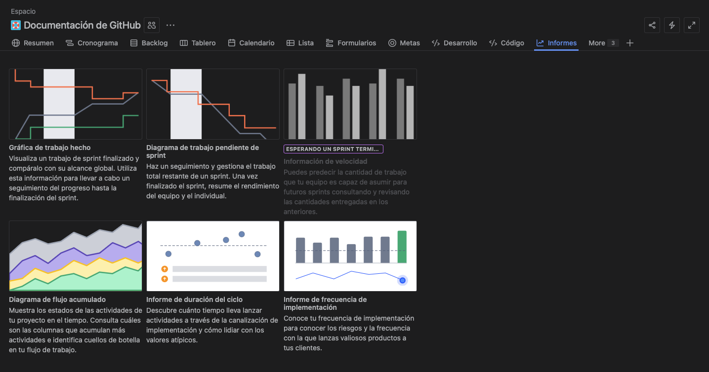

## Taller 4: Configuración de Reportes y Métricas

### 📌 Objetivo: 

Entender dónde encontrar las métricas clave.

### 📄 Conceptos Clave: 

```bash
    -   Lead Time: Tiempo total desde que se pide hasta que se entrega.
    -   Cycle Time: Tiempo desde que se empieza a trabajar hasta que se termina.
    -   Velocity: Cantidad de trabajo que un equipo puede completar en un sprint.
```

### Paso 01: Explorar los Reportes

```bash
    1.  Ve a Reportes.

    2.  Diagrama de Control (Control Chart): Busca y haz clic.
        Verás el Cycle Time y Lead Time de las incidencias que se completen.

    3.  Reporte de Velocidad (Velocity Report): Estará vacío hasta que completes tu primer sprint.
        Úsalo para predecir la capacidad futura.
```

<p align="center">
  
</p>

