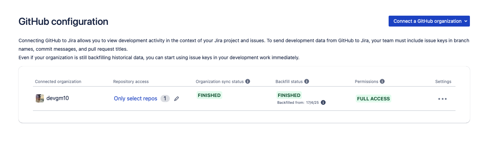
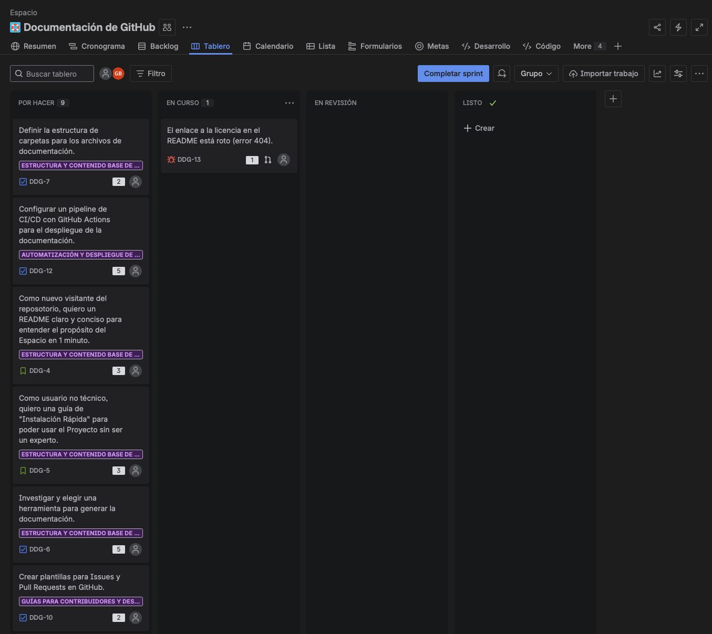
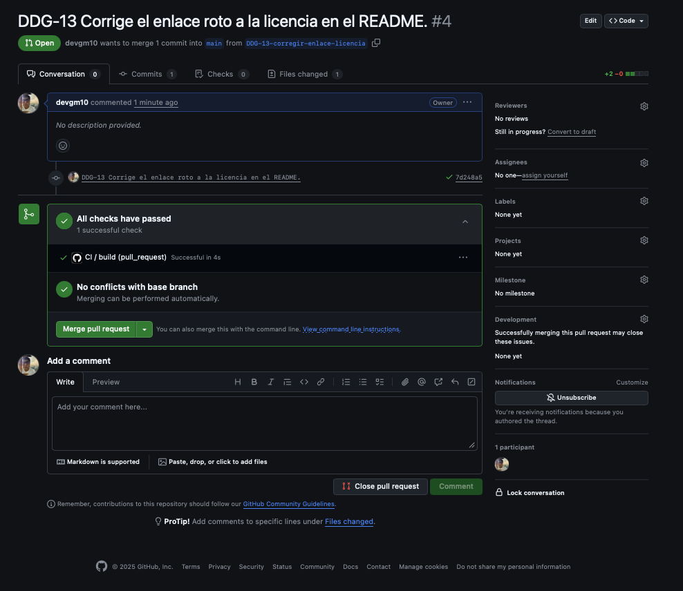
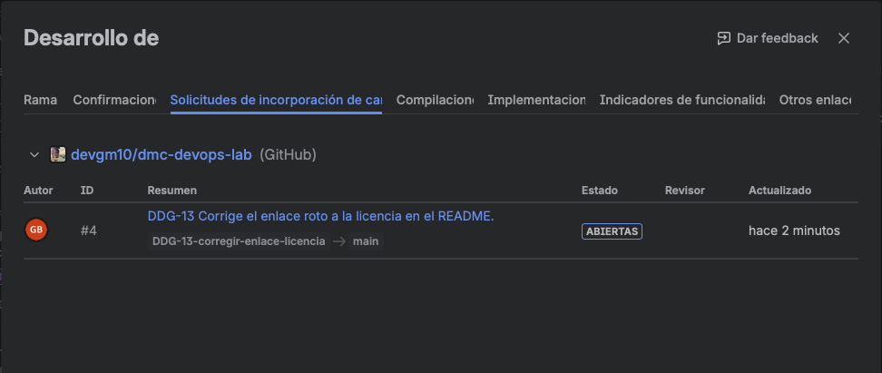
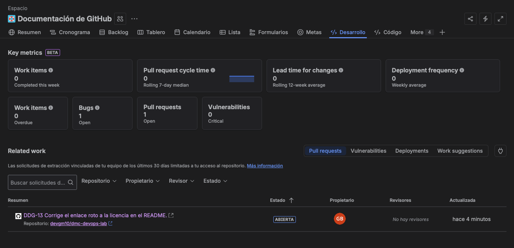
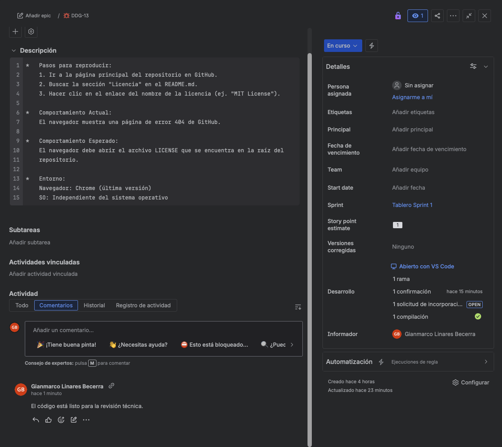
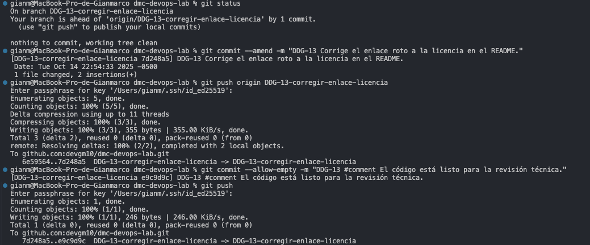

## Taller 5: Integración de Jira con GitHub

### 📌 Objetivo: 

Conectar Jira con tu repositorio de GitHub para automatizar el flujo de trabajo con
"Smart Commits".

### Paso 01: Instalar y Conectar "GitHub for Jira"

```bash
    1.  Primero asegurarnos que estamos logeados en https://github.com

    2.  Luego en Jira ve a "Código" -> "Conectar con GitHub".

    3.  Busca "GitHub for Atlassian", instálala y sigue el asistente para
        conectar tu cuenta y repositorio de GitHub. (Usar Opcion GitHub Cloud)

    4.  Click en "Configurar aplicacion" y seguir las indicaciones de configuración
```

<p align="center">
  
</p>


### Paso 02: El Flujo de Trabajo Conectado: Arreglando un Bug

```bash
    (*) Escenario:
        Vamos a trabajar en el Bug que creamos: El enlace a la licencia en el README está roto
        (error 404). Asumiremos que su clave es DDG-13. Al iniciar el trabajo, muévelo manualmente
        a "En curso" o crea la rama desde Jira para que se mueva automáticamente.
    
        a)  Crear la Rama de Trabajo desde Jira (o localmente):
            -   Navega a la incidencia DDG-13 en Jira.

            -   En el panel "Desarrollo", haz clic en "Crear rama". 
                Jira te redirigirá a GitHub y pre-rellenará un nombre de
                rama que incluye la clave, como DDG-13-corregir-enlace-licencia.

            -   Alternativa (en tu PC): Desde la terminal, puedes crearla tú mismo:
                git checkout -b DDG-13-corregir-enlace-licencia.

        b)  Realizar el Cambio y el Primer Commit (en tu PC):
            -   Asegúrate de estar en la nueva rama (git checkout DDG-13-corregir-enlace-licencia).

            -   Abre el archivo README.md y corrige el enlace roto.

            -   Guarda el archivo y haz commit del cambio. El mensaje debe incluir la clave de la incidencia
                para crear el enlace.

            $ git add README.md
            $ git commit -m "DDG-13 Corrige el enlace roto a la licencia en el README."
            $ git push -u origin DDG-13-corregir-enlace-licencia

        c)  Crear un Pull Request y Verificar la Conexión:
            -   En GitHub, crea un Pull Request desde tu rama. Asegúrate de que el título también incluya
                la clave DDG-13.

            -   Verificar en Jira: Vuelve a la incidencia DDG-13. En el panel "Desarrollo", 
                ahora verás la rama, el commit y el Pull Request vinculados.

        d) Usar Smart Commits para Agregar comentarios en Jira:
            -   Escenario: Has terminado de codificar y quieres que un compañero revise tu Pull Request.

            -   Ahora vas a agregar un comentario en Jira para reflejar esto, sin salir de tu terminal.

            -   Para que Jira realice la vinculación de forma correcta es necesario configurar en git
                correctamente tu usuario y email:

                $ git config user.email "EMAIL_GITHUB"
                $ git config user.name "NOMBRE_USUARIO_GITHUB"

            -   El comando para esto es #comment. Jira agregará el comentario

            -   Haz un nuevo commit (puede ser vacío si no hay más cambios de código) para enviar el
                comando:
            
                $ git commit --allow-empty -m "DG-1 #comment El código está listo para la revisión técnica."
                $ git push

            - Verificar en Jira: Valida que se haya agregado el comentario.
```

<p align="center">
  
</p>

<p align="center">
  
</p>

<p align="center">
  
</p>

<p align="center">
  
</p>

<p align="center">
  
</p>

<p align="center">
  
</p>

<p align="center">
  
</p>